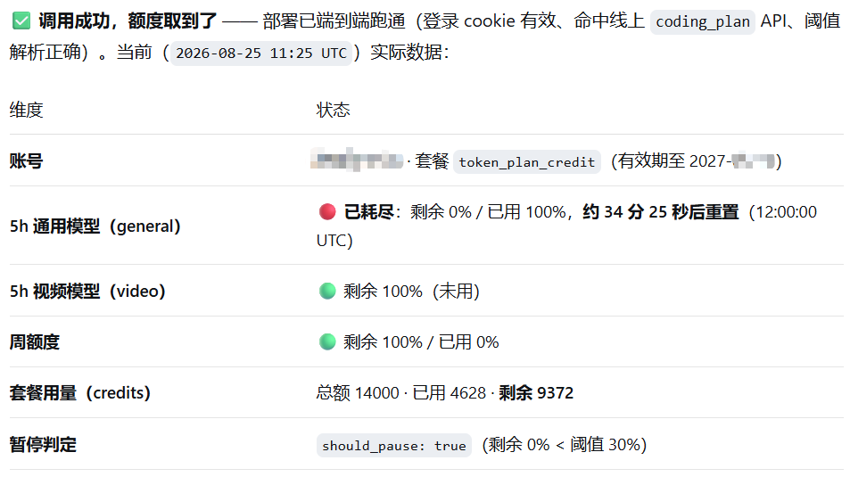

# minimax-remaining-mcp

> MCP 服务器：让 AI 代理知道 **MiniMax Token Plan** 套餐还剩多少额度，
> 以及什么时候该暂停自己以避免触发限流。

适配 **DeepSeek Harness (DSH)**、Claude Desktop、Cursor 等所有兼容 MCP 协议的客户端。

```
┌──────────────┐    stdio    ┌──────────────────────┐   HTTPS   ┌──────────────┐
│   AI 代理   │ ──────────► │  minimax-remaining-  │ ────────► │  MiniMax     │
│ (DSH 等)    │ ◄────────── │         mcp          │ ◄──────── │   Web API    │
└──────────────┘             └──────────┬───────────┘           └──────────────┘
                                        │
                                        ▼
                                 ┌─────────────┐
                                 │  Camoufox   │  一次性手动登录
                                 │  (Firefox)  │  → 持久化会话 cookie
                                 └─────────────┘
```

## 项目背景

MiniMax 网页控制台的 "5h 限额 / 61% 已用 / 2h56m 后重置" 面板其实由
两个 HTTP 接口驱动：

1. `/v1/api/openplatform/coding_plan/remains?GroupId=…` — 5 小时固定窗口的
   剩余百分比 + 倒计时
2. `/backend/account/token_plan_credit` — 套餐池（周维度）的累计额度

两个接口都不接受网页 UI 上的 `api_key`（长得像 `sk-cp-...`）作为
Bearer Token —— 用它会返回 `base_resp = {2062, "no active token plan"}`。
**唯一可行的方案是使用网页会话 cookie**（真实浏览器登录后的 `_token`）。
本项目用 Camoufox 维持一个持久化的 Firefox profile，让 cookie 在
MCP 服务器重启之间保留下来。

## 5 小时固定窗口（不是滚动窗口）

按 MiniMax 官方文档：

> 套餐内额度受 **5 小时固定窗口**和周窗口控制；未使用完的套餐内额度
> **不会结转**到下一个计费周期。

所以窗口边界是**固定**的时钟时段（典型为 CST 00:00 10:00 / 15:00 / 20:00
等），而不是从你的首次请求开始滚动。如果你在窗口切换前几秒查询，返回
的会是**下一个**窗口的数据。响应里的 `interval_start_iso` /
`interval_end_iso` 字段会告诉你具体是哪一段。

## 一行安装

```bash
# 方式 1：从 PyPI 安装（推荐）
pip install minimax-remaining-mcp
# 或
uv pip install minimax-remaining-mcp
# 或
uvx minimax-remaining-mcp    # 不安装直接运行

# 方式 2：从 GitHub 安装（无需 PyPI 账号）
pip install git+https://github.com/yang-cc/minimax-remaining-mcp.git

# 方式 3：本地开发模式
git clone https://github.com/yang-cc/minimax-remaining-mcp.git
cd minimax-remaining-mcp
uv venv .venv --python 3.12
uv pip install -e .
```

## 一次性登录

由于没有 Bearer Token 路径，需要先在 Camoufox 里手动登录一次：

```text
# 1. 启动服务器
python -m minimax_remaining_mcp.server
# 2. 在 MCP 客户端里调用：
minimax_login(timeout_seconds=600)
```

Camoufox 浏览器会弹出并打开 MiniMax 登录页。请手动完成
Cloudflare / CAPTCHA 验证、登录账号，直到浏览器进入 API Keys 页面。
服务器会自动检测到 `_token` cookie 并把会话持久化到 `data/cookies.json`。

## 🔌 DeepSeek Harness (DSH) 集成

DSH 通过 `@deepseek-ai/dsh-mcp-client` 加载 MCP 服务器。在
`~/.dsh/profiles/web/cordis.patch.yml` 里追加下面这段（**注意 package
名是 `minimax-remaining-mcp`，但 Python 模块路径是
`minimax_remaining_mcp.server`**）：

```yaml
- insert:
  - id: minimax-remaining-mcp
    name: '@deepseek-ai/dsh-mcp-client'
    config:
      serverName: minimax
      transport: stdio
      command: <repo>/.venv/Scripts/python.exe   # 或 uv 环境的 python
      args: ['-u', '-m', 'minimax_remaining_mcp.server']
      env:
        # 暂停阈值：5h 剩余低于 30% 时触发代理暂停
        MINIMAX_PAUSE_THRESHOLD_REMAINING_PCT: '30'
        # 储存目录（可选，默认 ./data）
        # MINIMAX_DATA_DIR: E:\\codex_dir\\.dsh\\state\\minimax-remaining-mcp
      failOnStartupError: false
      toolCallTimeoutMs: 180000
```

### DSH 集成要点

| 注意点 | 说明 |
|---|---|
| **`-u` 参数** | 让 Python stdio 不带缓冲，DSH 控制台能立刻看到 MCP 服务器日志。 |
| **Python 解释器路径** | 取决于安装方式：<br>• `pip install` → 用系统 Python 或 venv 中的 python<br>• `uv pip install -e .` → `<repo>/.venv/Scripts/python.exe`<br>• `uv tool install` → `uv tool run minimax-remaining-mcp` 也行，但 stdio 缓冲需要 `-u` |
| **首次启动需要登录** | DSH 启动 MCP 服务器时如果 `data/cookies.json` 不存在，调用 `minimax_login()` 会弹出浏览器窗口。 |
| **重启 DSH** | 修改 `cordis.patch.yml` 后必须重启 DSH 才会生效。 |
| **`failOnStartupError: false`** | 推荐设为 `false`，这样即使首次启动时 cookie 还没准备好，DSH 也不会立即报错。 |
| **持久化目录隔离** | 多个项目共用同一个 DSH 时，建议每个项目用不同的 `MINIMAX_DATA_DIR`，避免 cookie 互相覆盖。 |

### DSH 中的典型用法

DSH 启动后，会调用 `minimax_status()` 来判断剩余额度。你可以训练代理在
每次 MiniMax API 调用前先调用一次 `minimax_status()`，观察 `should_pause`
字段：

```text
remaining_percent_5h < 30  → should_pause=true → 代理应停下来或转做其他事
remaining_percent_5h >= 30 → should_pause=false → 可以继续调用
```

更彻底的方案是调用 `minimax_wait_for_quota()`，它会**阻塞**直到额度恢复
到阈值之上（默认 `MINIMAX_PAUSE_THRESHOLD_REMAINING_PCT`），省去代理自己
写轮询逻辑。

## 工具一览

| 工具 | 用途 |
|------|------|
| `minimax_status()` | 网页面板的全部数字：5h 剩余/已用 %、倒计时、套餐累计。低于阈值时设置 `should_pause=true`。 |
| `minimax_window()` | 仅返回代理本地的 5h 观测窗口状态（**与 MiniMax 的固定窗口是分开的**，仅用于代理自节流）。 |
| `minimax_consume(delta=N)` | 把本地窗口消费计数器加 N。每次 MiniMax API 调用后调用一次。 |
| `minimax_wait_for_quota(target_pct=None, poll_seconds=60)` | **阻塞**到 5h 剩余百分比 ≥ `target_pct`。关闭 MCP 连接可中断。 |
| `minimax_login(timeout_seconds=600)` | 弹出 Camoufox 浏览器窗口用于手动登录。 |
| `minimax_smoke()` | 快速 Camoufox 健康检查（打开 example.com）。 |
| `minimax_info()` | 静态配置 + 最近一次会话元数据。 |
| `minimax_clear(confirm=True)` | 清空 cookies / session / window 状态。 |

### `minimax_status()` 响应示例

实际诊断输出(当 5h 窗口已耗尽、应触发暂停时):



下面是规范化后的 JSON 结构:

```jsonc
{
  "ok": true,
  "source": "coding_plan",
  "remaining_percent_5h": 76,             // 5h 窗口剩余 %
  "used_percent_5h": 24,                 // 5h 窗口已用 %
  "seconds_until_reset_human": "4h21m35s",
  "interval_end_iso": "2026-08-25T12:00:00+00:00",
  "interval_status_text": "active",      // active | exhausted | inactive
  "remaining_percent_weekly": 100,
  "seconds_until_weekly_reset_human": "5d08h42m",
  "total_credits": 14000,                // 套餐累计（周维度）
  "used_credits": 3188,
  "remaining_credits": 10812,
  "user_name": "...",
  "group_id": "...",
  "should_pause": false,                 // 低于阈值时为 true
  "model_remains": [
    { "model_name": "general",  "interval_remaining_percent": 76, "interval_status": 1 },
    { "model_name": "video",    "interval_remaining_percent": 100, "interval_status": 3 }
  ]
}
```

## 暂停阈值语义

`MINIMAX_PAUSE_THRESHOLD_REMAINING_PCT=30` 的意思是 **当 5h 窗口的剩余
百分比 < 30% 时暂停**（即已用超过 70%）。对比的是 `remaining_percent_5h`，
**不是**套餐累计的 `remaining_credits` —— 这两者是独立指标。

## 持久化文件

所有状态以纯 JSON 储存在 `data/`（已被 `.gitignore` 屏蔽）：

```
data/
├── cookies.json                # Camoufox 会话 cookie
├── session.json                # 最近一次登录元数据
├── window.json                 # 代理本地的 5h 观测窗口
├── last_usage.json             # 最近一次成功的 API 响应（缓存）
└── profile/                    # Camoufox 持久化 Firefox profile（~150 MB）
```

如果 `coding_plan/remains` 返回 401/403，完整响应体会写到
`data/last_coding_plan_failure.json` 方便排查 —— 在怀疑服务挂了之前先
看这个文件。

## 环境变量

全部可选，默认值见下表。

| 变量 | 默认 | 说明 |
|------|------|------|
| `MINIMAX_PAUSE_THRESHOLD_REMAINING_PCT` | `30` | 5h 剩余低于此值时暂停。 |
| `MINIMAX_WINDOW_SECONDS` | `18000` | 代理本地窗口长度（5h）。 |
| `MINIMAX_HEADFUL_ON_LOGIN` | `1` | 登录时强制显示浏览器窗口。 |
| `MINIMAX_CAMOUFOX_OS` | auto | `windows` / `macos` / `linux`。 |
| `MINIMAX_CAMOUFOX_LOCALE` | `zh-CN` | 浏览器语言。 |
| `MINIMAX_HTTP_TIMEOUT` | `15` | API 请求超时（秒）。 |
| `MINIMAX_DATA_DIR` | `./data` | cookies / session 储存目录。 |
| `MINIMAX_WEB_URL` | `https://platform.minimaxi.com` | 覆盖控制台基础 URL。 |
| `MINIMAX_USAGE_API_URL` | `…/backend/account/token_plan_credit` | 套餐池 endpoint。 |
| `MINIMAX_REMAINS_API_URL` | `…/v1/api/openplatform/coding_plan/remains` | 5h 窗口 endpoint。 |
| `MINIMAX_REMAINS_API_URL_FALLBACK` | `api.minimaxi.com/...` | 主 endpoint 失败时使用。 |
| `MINIMAX_LOGIN_HINT_URL` | `…/user-center/basic-information/interface-key` | 登录落地页。 |

## 本地开发 & 调试

```bash
# 启动 MCP 服务器（stdio 模式）
.venv\Scripts\python.exe -u -m minimax_remaining_mcp.server
# 或（Windows）
run.bat

# 直接探测 coding_plan 接口（无需 MCP / 浏览器）
.venv\Scripts\python.exe probe_coding_plan.py

# 检查持久化状态
cat data/cookies.json | head -c 200
cat data/session.json
cat data/last_coding_plan_failure.json   # 如果存在
```

## 打包发布到 PyPI（维护者用）

```bash
# 安装打包工具
pip install build twine

# 在项目根目录构建 wheel + sdist
python -m build
# → dist/minimax_remaining_mcp-0.1.0-py3-none-any.whl
# → dist/minimax_remaining_mcp-0.1.0.tar.gz

# 检查产物
twine check dist/*

# 上传到 PyPI（需要先 `twine login` 或用 token）
twine upload dist/*
# 或：uv publish dist/*
```

发布后任何人可以：

```bash
pip install minimax-remaining-mcp
uv pip install minimax-remaining-mcp
uvx minimax-remaining-mcp    # 临时运行
```

## 限制

- **没有 Bearer-key 路径。** MiniMax 目前没有为 Coding Plan API 发放订阅
  密钥；网页控制台上的 `api_key` 当作 Bearer 用会返回 `2062 "no active
  token plan"`。唯一可行的是会话 cookie。
- **Cloudflare / CAPTCHA 需手动完成。** 首次登录必须由真人完成。
  本项目不接入任何打码服务。
- **5h 窗口是 CST 固定时段。** 在窗口切换前查询，会拿到下一个窗口的数据。
  `interval_start_iso` / `interval_end_iso` 告诉你具体是哪一段。
- **套餐累计（`remaining_credits`）不会结转。** 它是周维度的累计池，
  不会随 5h 窗口重置而清零。

## 许可证

MIT — 详见 `LICENSE`。